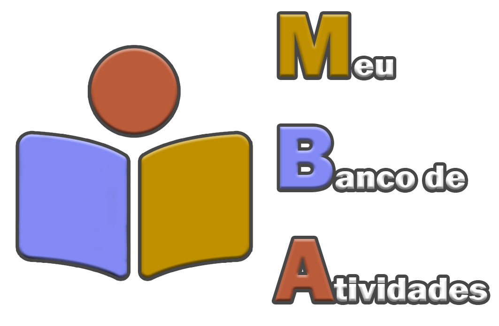
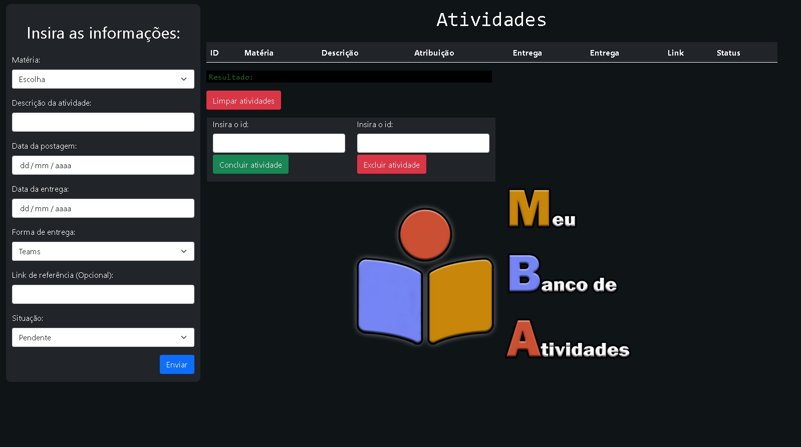
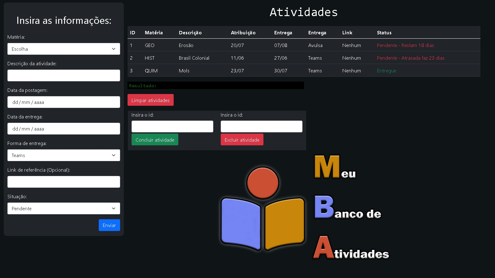
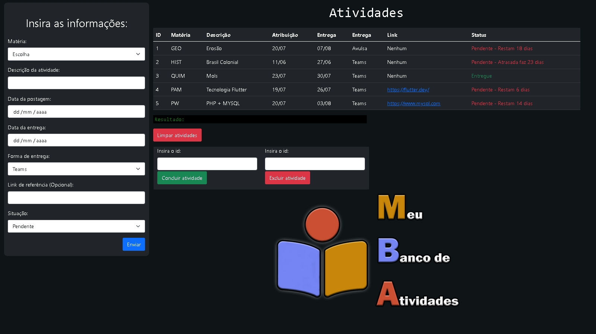

# MBA - Meu Banco de Atividades

 Ao tentar organizar suas tarefas por uma ferramenta, você já sentiu uma forte burocracia para incluir algo muito simples? Ou até oferecer muitas opções que acabam mais te atrapalhando do que ajudando? O MBA pode te ajudar nisso. Ainda em fase beta, ou seja, em desenvolvimento, o MBA oferece uma forma mais direta e simples para criar e gerenciar tarefas de seu dia-a-dia ou até escolares.

###  

# Imagens

###  

## O MBA foi escrito em:
 
 
 
 
###  
# Instalação e uso:

Por enquanto o MBA só funciona via servidor, pois foi escrito em PHP. 
Para resolver este problema, iremos utilizar o XAMPP.

Segue o tutorial de instalação do banco de dados e do MBA no seu servidor local.

- ## 1° Passo - Preparação:
    - Baixe o zip deste repositório.
    - Abra o XAMPP.
    - Dê start no Apache e no MYSQL.
- ## 2° Passo - Instalação do banco de dados:
    - Extraia o zip desse repositório na pasta __C:\xampp\htdocs__.
    - Abra o shell do XAMPP e acesse o MYSQL por ele.
        - > mysql -u root --password
    - Caso peça alguma senha, apenas dê enter.
    - Copie tudo que está presente no arquivo [banco_MBA.sql](banco_MBA.sql).
    - Cole em seu console e execute.
    - Após o término desses passos, você pode fechar o shell a vontade.
- ## 3° Passo - Uso:
    - Por enquanto a ferramenta apenas suporta matérias da base NovoTec do curso de D.S. da ETEC. Porém peço o favor para que criem issues, assim poderei criar novos patches de acordo com sua necessidade.
    - Segue o vídeo de um exemplo prático realizado no aplicativo: [Tutorial](https://www.youtube.com/watch?v=SFG1XuRsE2U)

# Recados finais
A aplicação ainda está bem moldável, assim como eu disse no vídeo, caso queira participar do projeto ou ajudar em algo, entre em contato comigo por meio do telegram deixado na minha Bio. Assim poderemos discutir e até entrar em um consenso de novas funcionalidades e etc.
 
 
__Assista o vídeo tutorial__, ele é muito importante! Nele eu explico sobre as matérias e as forma de entrega, podendo ter a possibilidade de ser incluídas ainda mais possibilidades.

